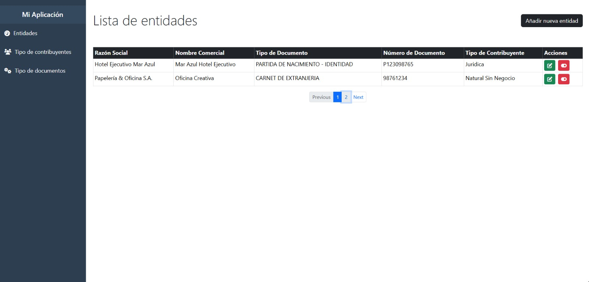
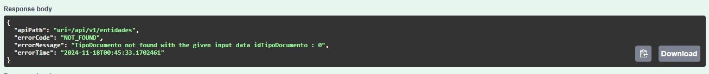
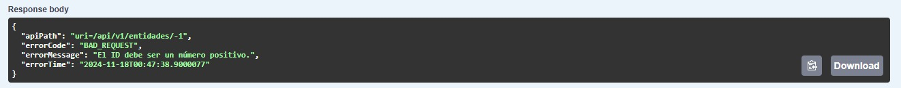

# Prueba Técnica

Este documento describe los aspectos principales de la implementación de la prueba técnica, incluyendo los endpoints de la API, manejo de tokens JWT, uso de Spring HATEOAS, paginación de entidades, manejo global de
excepciones y la implementación de pruebas unitarias tanto en el backend como en el frontend.

## 1. Endpoints en Swagger

A continuación se muestran los diagramas del flujo de los endpoints disponibles en la API:

---

## 2. Json Web Token (JWT)

La autenticación se maneja mediante tokens JWT. A continuación se muestra un diagrama que ilustra su funcionamiento:

---

## 3. Respuesta del JSON con Spring HATEOAS

El siguiente diagrama muestra cómo se estructura la respuesta JSON utilizando Spring HATEOAS para agregar enlaces de recursos relacionados:

---

## 4. Paginación para Entidades

Para manejar grandes volúmenes de datos, se implementó la paginación. A continuación se presentan los diagramas que explican cómo se implementa y visualiza la paginación:

---

## 5. Eliminar Entidades

Opté por **no utilizar el método eliminar** en las entidades, ya que esta acción podría afectar información sensible. En lugar de ello, se opta por deshabilitar el estado de las entidades.

---

## 6. Actualización de Entidades

Para la actualización de las entidades, se sigue un flujo estándar que se muestra en el siguiente diagrama:

---

## 8. Manejo Global de Excepciones

Para manejar las excepciones de manera centralizada y personalizada en la aplicación, se implementó una clase `GlobalExceptionHandler` utilizando la anotación `@ControllerAdvice` y extendiendo `ResponseEntityExceptionHandler`. Esta clase captura diferentes tipos de excepciones y genera respuestas adecuadas con los detalles del error, incluyendo códigos de estado HTTP y mensajes específicos.

A continuación se describen los manejadores de excepciones implementados:

- **Manejo de errores de validación (MethodArgumentNotValidException)**: Captura errores de validación de los parámetros de la solicitud, como los campos de un objeto que no cumplen con las restricciones de validación. Devuelve un mapa con los nombres de los campos y los mensajes de error asociados, con un código de estado HTTP `400 Bad Request`.

- **Método no permitido (HttpRequestMethodNotSupportedException)**: Captura cuando un método HTTP no está permitido para la ruta solicitada (por ejemplo, un `GET` en una ruta que solo permite `POST`). Devuelve un objeto `ErrorResponseDto` con el detalle del error y un código de estado `405 Method Not Allowed`.

- **Solicitud malformada (HttpMessageNotReadableException)**: Captura errores en la deserialización de la solicitud (por ejemplo, JSON mal formado). Devuelve un objeto `ErrorResponseDto` con un mensaje de error y un código de estado `400 Bad Request`.

- **Violación de restricciones (ConstraintViolationException)**: Captura violaciones de restricciones de validación personalizadas, como las definidas con `@NotNull`, `@Size`, entre otras. La excepción proporciona un mensaje detallado con las violaciones, que se devuelve en la respuesta con un código de estado `400 Bad Request`.

- **Recurso no encontrado (ResourceNotFoundException)**: Captura cuando un recurso no se encuentra (por ejemplo, cuando se intenta acceder a una entidad que no existe en la base de datos). Se devuelve un objeto `ErrorResponseDto` con un mensaje de error y un código de estado `404 Not Found`.
- Algunas respuestas:
---
---

## 8. Implementación de Pruebas Unitarias

### Backend:
- **Capa de Servicio de "Entidad"**: Se implementaron pruebas unitarias para la capa de servicio de "Entidad". Esto asegura que la lógica de negocio relacionada con las entidades funcione correctamente, cubriendo casos como la creación, actualización, eliminación lógica, y recuperación de entidades. Se utilizaron frameworks como JUnit y Mockito para simular las dependencias y verificar el comportamiento del servicio.

### Frontend:
- **Servicio de "Entidad"**: En el frontend, se implementaron pruebas unitarias para el servicio de "Entidad". Estas pruebas verifican que el servicio de datos interactúe correctamente con la API backend y maneje adecuadamente las respuestas, incluyendo casos de éxito y error.
  
- **Componente de "Entidad"**: También se realizaron pruebas unitarias para el componente de "Entidad". Estas pruebas validan el comportamiento del componente, asegurando que las interacciones con la interfaz de usuario y los servicios de backend funcionen correctamente, como la visualización de datos.

---
