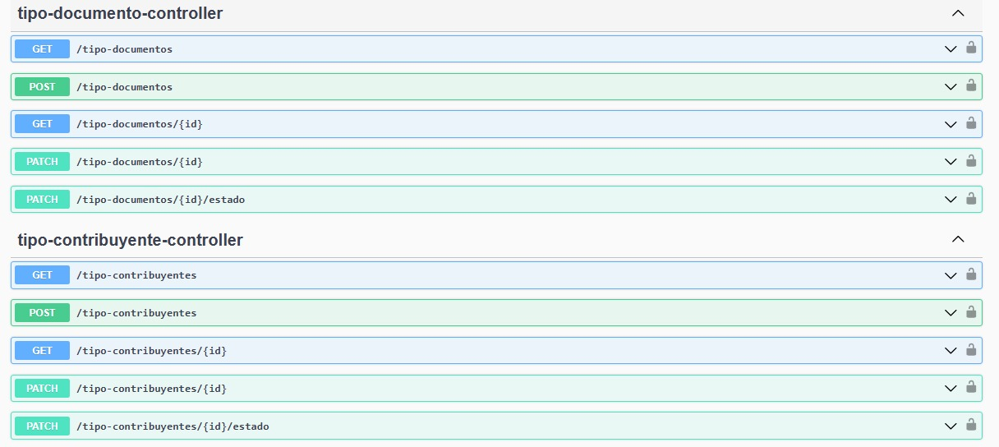
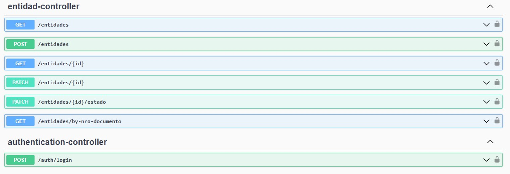
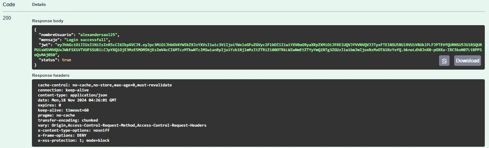
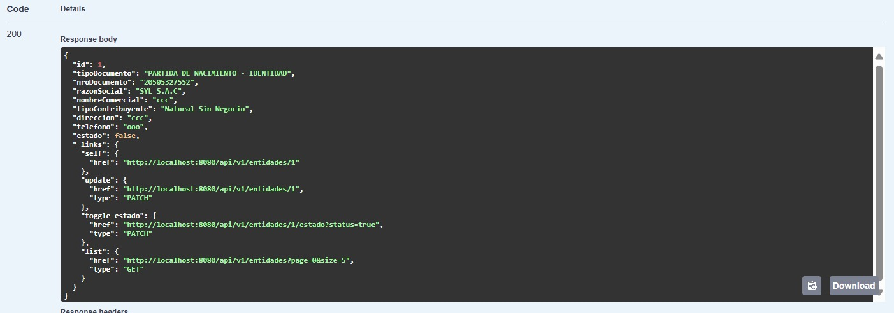
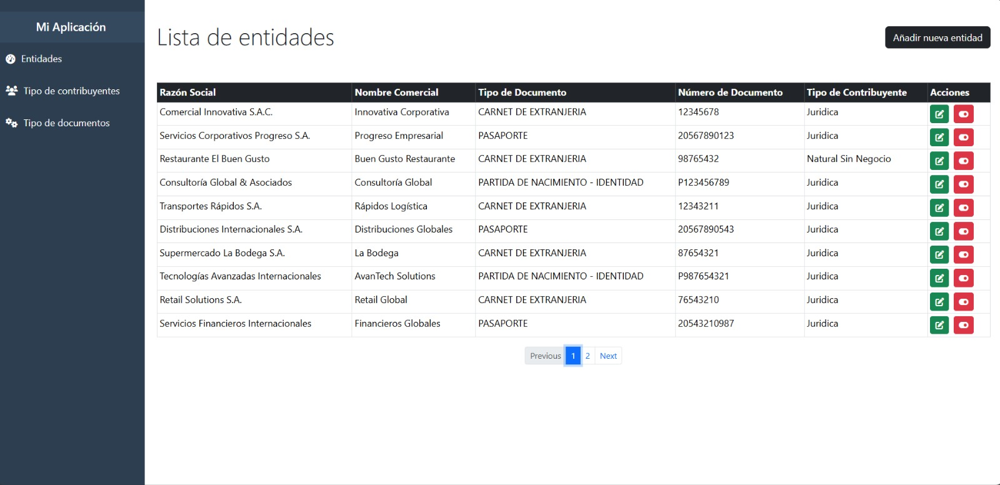
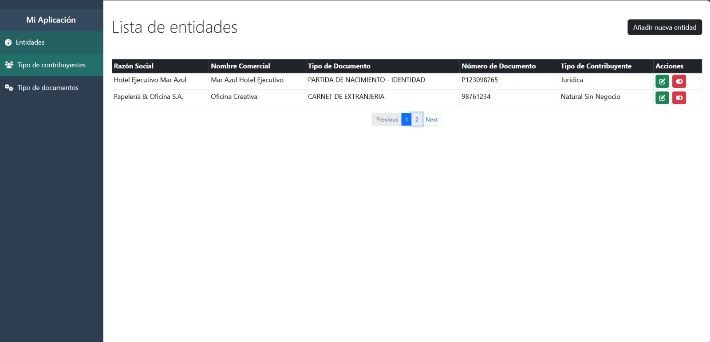
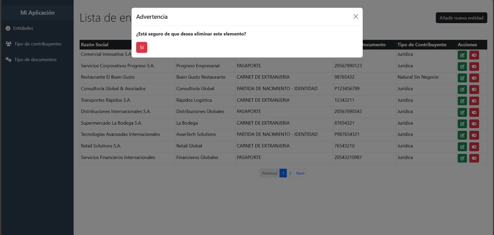
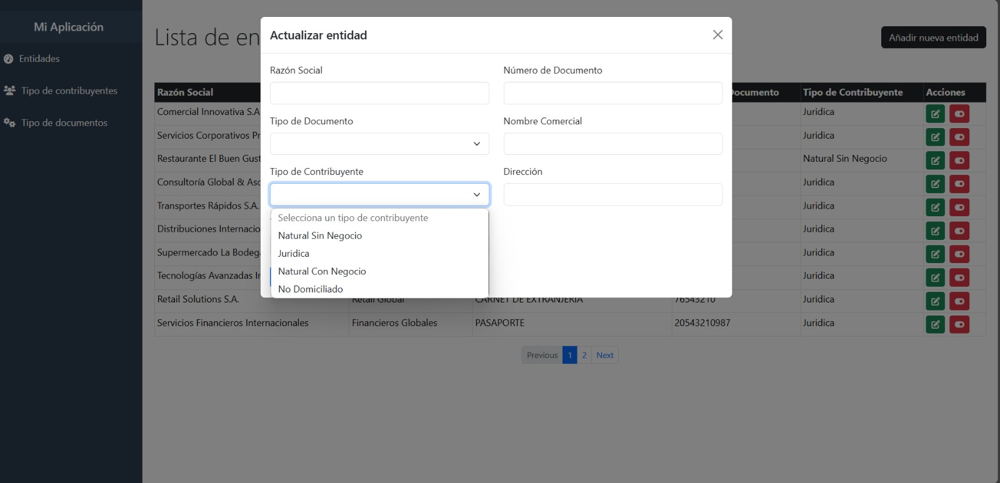

# Prueba técnica

## Endpoints en swagger

## Json Web token

## Respuesta del json con spring hateoas
  

## Paginacion para entidades

## Eliminar para entidades (Opte no usar el metodo eliminar en las entidades porque suele ser informacion sensible) , opte por la opcion de desabilitar el estado

## Actualizar para entidades

